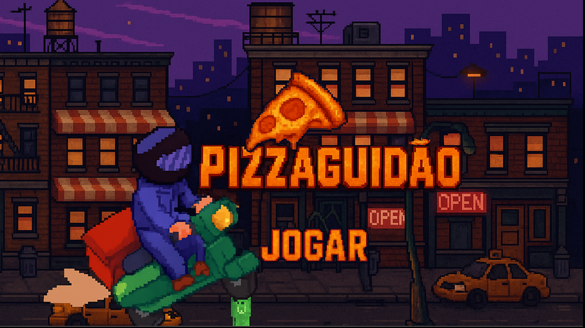

# 🍕 Pizzaguidão

**Pizzaguidão** é um jogo no estilo **Roguelike** em que você deve atravessar obstáculos e escapar de mendigos para devolver uma pizza ao professor Renzo! 🍕🚴‍♂️

Este projeto foi desenvolvido durante o **CPG**, realizado no **INATEL**, com um prazo de apenas **36 horas** — e o mais incrível: ninguém da equipe tinha experiência prévia com desenvolvimento de jogos! 🎮💥

👉 **[Clique aqui para jogar agora](https://stenishh.github.io/Pizzaguidao/)**

---

## 🕹️ Como Jogar

- 🔼 Use as **setas do teclado** para controlar a pizza motorizada.
- 🕳️ Evite cair nos buracos e desvie dos mendigos!
- 🍕 Colete pizzas no caminho e devolva ao **professor Renzo**.
- 🎬 Após a cutscene, **pressione a barra de espaço** para começar o jogo.  
  > *Sim... esquecemos de colocar essa dica no jogo — afinal, foi nosso primeiro! 😅*

---

## 📸 Captura de Tela

> A adrenalina começa aqui! 🍕💨

---

## 🧠 Sobre o Projeto

> “Nos jogamos de cabeça no desconhecido. Em 36 horas, aprendemos, erramos e criamos algo do zero. Essa é a essência do Hackathon — e o Pizzaguidão nasceu dessa ousadia.” 🚀

---

Desenvolvido com pizza, energético e poucas horas de sono. 😴🍕
